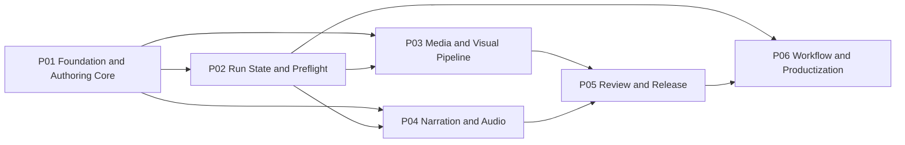

# Agent Video MVP Project Execution Index

> **For agentic workers:** REQUIRED SUB-SKILL: Use superpowers:subagent-driven-development (recommended) or superpowers:executing-plans to implement each linked project plan task-by-task. Steps use checkbox (`- [ ]`) syntax for tracking.

**Goal:** Deliver the Agent Video MVP through six bounded projects with explicit dependencies, disjoint primary write sets, executable verification gates, and stable handoff contracts.

**Architecture:** Foundation and runtime-state projects establish shared contracts first. The visual and narration/audio projects then proceed independently, after which review/release integrates their artifacts and workflow productization adds Presets, Execution Plans, CLI orchestration, and end-to-end acceptance.

**Tech Stack:** Node.js 22, pnpm 10, TypeScript, React, Remotion, FFmpeg/ffprobe, Zod, Commander, Vitest.

---

## Authoritative Documents

- Product and architecture specification: [Remotion/FFmpeg Agent Video MVP Design](../specs/2026-08-09-remotion-ffmpeg-agent-video-mvp-design.md)
- Cross-project master reference: [Agent Video MVP Master Plan](2026-08-09-agent-video-mvp-implementation.md)
- Executable project plans: the six plans linked below.

If documents conflict, use this order: specification behavior, child-project task and exit gate, master-plan cross-project context.

## Dependency Graph

## Project Matrix

| ID | Project | Master Tasks | Depends On | Primary Deliverable | Executable Plan |
| --- | --- | --- | --- | --- | --- |
| P01 | Foundation and Authoring Core | 1–4 | None | Strict inputs, opaque project-directory scopes, process-group completion, borrowed FD and Gate contracts | [P01 Plan](2026-08-09-agent-video-mvp-01-foundation-authoring.md) |
| P02 | Run State and Preflight | 5–6 | P01 | Fingerprints, immutable Runs, locks, atomic pointers, `doctor` | [P02 Plan](2026-08-09-agent-video-mvp-02-run-state-preflight.md) |
| P03 | Media and Visual Pipeline | 7, 10, 11 | P01, P02 | Ingest, EDL compile, fixed components, muted Remotion render | [P03 Plan](2026-08-09-agent-video-mvp-03-media-visual-pipeline.md) |
| P04 | Narration and Audio | 8, 9, 12 | P01, P02 | TTS cache, narration master, captions, BGM mix and loudness | [P04 Plan](2026-08-09-agent-video-mvp-04-narration-audio.md) |
| P05 | Review and Release | 13–14 | P03, P04 | Draft evidence, explicit Review Gate, verified release package | [P05 Plan](2026-08-09-agent-video-mvp-05-review-release.md) |
| P06 | Workflow and Productization | 15–16 | P02, P05 | Stage registry, Presets, Execution Plan, Runner, CLI and E2E | [P06 Plan](2026-08-09-agent-video-mvp-06-workflow-productization.md) |

## Execution Waves

1. **Wave 1 — P01:** Establish all shared domain, filesystem, process, and Gate contracts.
2. **Wave 2 — P02:** Establish immutable execution state and the target-Mac environment Gate.
3. **Wave 3 — P03 and P04:** Execute in parallel after P02. Their primary write sets are disjoint; both consume P01/P02 contracts without redefining them.
4. **Wave 4 — P05:** Integrate the muted visual output and narration/audio output into a reviewed draft and final release.
5. **Wave 5 — P06:** Add orchestration only after every concrete Stage works independently, then prove all nineteen MVP acceptance criteria.

## Shared Contract Freeze Points

- **After P01:** Authoring Schemas, generated Manifest shapes, opaque `ProjectDirectoryScope` APIs, borrowed `extraStdioFds`, `ProcessResult`, `CheckResult`, and Gate states are frozen. Later projects may extend through versioned changes only.
- **After P02:** Fingerprint format, Run directory layout, project lock record, and `current.json` publication protocol are frozen.
- **After P03:** `asset-manifest.json`, `compiled-timeline.json` containing narration intervals plus BGM metadata (not Ducking envelopes), registered component IDs, and muted-render contract are frozen.
- **After P04:** `narration-manifest.json`, caption cue semantics, SRT formatting, deterministic Audio Mix fingerprint inputs, fixed `audio/filter-graph.txt` path/SHA-256 Stage output, and mixed-audio contract are frozen.
- **After P05:** Review evidence, release directory layout, validation report, and final media profile are frozen.
- **P06 rule:** Runner and CLI consume these contracts; they must not duplicate Stage business logic or introduce a second artifact format.

## Parallel Work Rules

- P03 owns `src/media/ffprobe.ts`, `src/media/transcode.ts`, `src/timeline/**`, `src/remotion/**`, and the Ingest/Compile Stage implementations.
- P04 owns `src/providers/**`, `src/narration/**`, `src/captions/**`, `src/media/audio-mix.ts`, `src/media/loudness.ts`, and the Narration Stage implementation.
- P03 and P04 must not both modify P01/P02 contract files. A required contract change stops both projects and is applied first as a reviewed P01/P02 amendment.
- P05 and P06 run sequentially because they integrate or orchestrate all prior Stage outputs.

## Handoff Protocol

Each project handoff must include:

1. Its project exit verification commands with zero failures.
2. The commit hashes produced by that plan's tasks.
3. A list of frozen artifact schemas or interfaces introduced by the project.
4. Any target-Mac-only smoke test that was skipped in generic CI.
5. Confirmation that no later-project files were implemented early.
6. For P04, evidence that `audio/filter-graph.txt` is recorded with SHA-256 in Stage outputs and invalidates on every frozen Audio Mix fingerprint input.

## Completion Definition

The MVP is complete only when all six project exit gates pass in dependency order and P06 demonstrates all nineteen acceptance criteria from the specification. Passing an individual project does not authorize bypassing Review, full decode, source-hash verification, or atomic publication requirements.
