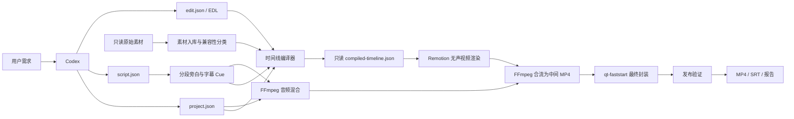

# Remotion + FFmpeg 本地 Agent 视频生产系统 MVP 技术设计

## 1. 文档信息

| 项目 | 内容 |
| --- | --- |
| 文档状态 | MVP 范围已确认，可进入实施计划阶段 |
| 目标平台 | macOS 15+、Apple Silicon、ARM64 |
| 系统形态 | 本地 CLI 驱动的声明式视频生产流水线 |
| 核心技术 | TypeScript、React、Remotion、FFmpeg、ffprobe |
| 首版输出 | 1920 × 1080、30 FPS、SDR、H.264、AAC、MP4、SRT |
| 剪辑方式 | Codex 生成显式 EDL，不做自动语义选片 |
| 原始文档 | `/Users/liuweitian1/Desktop/AICoding/Remotion-FFmpeg-Agent-Video-Technical-Design.md` |

本文档是原生产级方案的 MVP 优化版。原文档保留为长期架构参考，本文档作为首版实现依据。

## 2. 评审结论

原方案的方向正确，尤其是以下设计值得保留：

- 将视频工程视为可编译、可验证的声明式工程。
- 区分脚本文本和实际语音时间。
- 原始素材只读。
- 每个阶段生成结构化报告。
- 支持失败恢复和局部缓存。
- Codex 负责修改工程，程序化验证器负责执行硬性检查。

原方案不适合作为首版直接实施，核心原因不是技术不可行，而是同时建设了过多生产级能力。

### 2.1 必须修正的问题

| 优先级 | 问题 | MVP 处理方式 |
| --- | --- | --- |
| P0 | 缺少明确的剪辑决策模型 | 新增 `edit.json`，保存显式 EDL |
| P0 | `script.json`、`project.json` 和生成时间线职责重叠 | 明确输入文件与只读生成物边界 |
| P0 | Remotion 和媒体工具链都承担最终音频职责 | Remotion 始终渲染无声视频；FFmpeg 独占最终混音/中间封装，`qt-faststart` 仅负责最终 MP4 atom 重排 |
| P1 | 16 个阶段和完整 DAG 超出 MVP 范围 | 压缩为 7 个线性阶段，使用阶段指纹恢复 |
| P1 | CosyVoice、WhisperX 对首版 macOS 环境过重 | 默认使用 macOS `say` 或用户提供的分段 WAV |
| P1 | 所有素材强制 CFR 转码成本过高 | 先分类，仅对不兼容素材生成渲染副本 |
| P1 | 字级字幕、ASR 回听和强制对齐一次性实施 | 首版采用“一段脚本对应一个字幕 Cue”，ASR 仅作为可选验证器 |
| P1 | 任意项目自定义 React 组件扩大安全面 | 首版只允许固定组件注册表 |
| P2 | 通用 Artifact Store、GC、并发 DAG 调度过早 | 使用项目级工作目录和简单 Build State |
| P2 | 黑帧、冻结帧等检测容易误报 | 完整解码是硬 Gate，语义质量检测先作为复核项 |

## 3. MVP 目标

首版只解决一个完整场景：

> 在一台 Apple Silicon Mac 上，Codex 根据中文脚本和显式 EDL，使用本地素材生成带旁白、背景音乐和字幕的 1080p 横屏视频，并输出可审计的验证报告。

具体目标：

1. 导入本地视频、图片和一条背景音乐。
2. 使用结构化中文脚本生成分段旁白。
3. 支持用户为每段提供 WAV，或调用 macOS `say` 生成本地旁白。
4. Codex 使用明确的素材 ID、入点、出点、时间线位置生成 EDL。
5. 生成基础标题和普通底部字幕。
6. 输出低分辨率草稿、联系表和复核记录。
7. 输出 1080p H.264 MP4、AAC 音频、SRT 和 JSON 验证报告。
8. 修改单个脚本段落后，只重新生成该段旁白，并重新执行必要的下游阶段。
9. 任一硬性检查失败时，不发布最终文件。

## 4. MVP 非目标

以下能力明确延期：

- 自动理解全部素材并进行语义选片。
- 字级强制对齐和逐字高亮字幕。
- WhisperX、CosyVoice、Piper 作为默认运行依赖。
- 多说话人识别和说话人分离。
- 声音克隆。
- 竖屏、方形和多输出比例。
- H.265、AV1、ProRes 母版。
- HDR、广色域、10-bit 和色调映射。
- 通用特效系统和第三方插件。
- 项目级任意 React 代码动态加载。
- 通用 DAG 调度、远程 Worker 和分布式缓存。
- JSON/YAML 动态 Workflow 定义、条件表达式 DSL 和运行时步骤插件。
- 手工维护 `requiresArtifacts`/`producesArtifacts` 依赖图。
- 专业调色、复杂转场、变速和多机位剪辑。
- 原视频声音、独立音效轨和多总线混音。
- 云端协作和社交平台自动发布。

## 5. 运行约束

### 5.1 平台约束

- 仅支持 macOS 15+、Apple Silicon。
- Node.js、pnpm、Remotion 和全部 npm 依赖必须通过锁文件固定。
- FFmpeg 和 ffprobe 必须来自同一构建版本。
- 首次准备依赖和语音模型时允许联网；正式流水线默认离线运行。
- 所有字体必须随项目提供，渲染期间不得下载远程字体。

### 5.2 媒体约束

- 输出画布固定为 1920 × 1080。
- 输出帧率固定为整数 30 FPS。
- 输出色彩固定为 SDR BT.709 和 `yuv420p`。
- 输出视频固定为 H.264。
- 输出音频固定为 AAC、48kHz、立体声。
- HDR、Dolby Vision、10-bit 和无法可靠识别色彩信息的输入在 MVP 中直接拒绝。
- 视频素材默认静音，只使用旁白和一条背景音乐。

### 5.3 信任边界

- `assets/source` 下的原始素材不可写。
- 项目数据只能引用项目目录内的相对路径。
- 项目 JSON 不是可执行代码。
- Remotion 只能渲染预先注册的组件类型。
- Codex 修改仓库源代码属于开发行为，不属于项目运行时扩展机制。
- “媒体本地处理”仅表示流水线不主动上传素材；Codex 产品本身是否发送提示词或选定图片，由其运行环境和组织策略决定。

## 6. 总体架构



### 6.1 核心边界

| 组件 | 负责 | 不负责 |
| --- | --- | --- |
| Codex | 修改脚本、EDL 和注册组件源码；读取报告并修复 | 判定硬性验证自动通过 |
| Pipeline Runner | 串联阶段、计算指纹、恢复和写报告 | 理解视频语义 |
| Remotion | 画面、图片、标题和字幕的帧级渲染 | 最终音频混合和发布封装 |
| FFmpeg/ffprobe/qt-faststart | 探测、兼容转码、音频处理、中间合流、MP4 atom 重排、完整解码验证 | 生成剪辑决策 |
| TTS Provider | 生成单个脚本段落的语音文件 | 决定视频时间线和字幕样式 |

## 7. 真相源与生成物

### 7.1 可编辑输入

只有以下内容允许被用户或 Codex 直接修改：

| 文件或目录 | 职责 |
| --- | --- |
| `project.json` | 输出格式、字体、字幕样式、音频策略和 Provider 配置 |
| `script.json` | 旁白展示文本、TTS 文本、段落顺序和停顿 |
| `edit.json` | 显式 EDL，包括素材、入点、出点和时间线位置 |
| `assets/source/` | 用户提供的只读素材 |
| `assets/fonts/` | 本地字体 |
| `src/remotion/registry.ts` | 受信任的 Remotion 组件注册表 |

### 7.2 只读生成物

以下内容只能由流水线生成，Codex 不应直接编辑：

- `asset-manifest.json`
- `narration-manifest.json`
- `captions.json`
- `compiled-timeline.json`
- `build-state.json`
- 阶段验证报告
- 草稿和最终输出

### 7.3 冲突解决规则

- 脚本文字以 `script.json` 为准。
- 视觉剪辑意图以 `edit.json` 为准。
- 实际旁白时长以生成的 WAV 为准。
- 实际发布时间线以 `compiled-timeline.json` 为准。
- `compiled-timeline.json` 失效时必须重新编译，禁止手工修补。

## 8. 推荐目录结构

```text
auto-cut-video/
├── AGENTS.md
├── package.json
├── pnpm-lock.yaml
├── remotion.config.ts
├── tsconfig.json
├── src/
│   ├── cli/
│   │   └── videoctl.ts
│   ├── domain/
│   │   ├── project-schema.ts
│   │   ├── script-schema.ts
│   │   ├── edit-schema.ts
│   │   ├── manifest-schema.ts
│   │   └── validation-schema.ts
│   ├── media/
│   │   ├── ffmpeg.ts
│   │   ├── ffprobe.ts
│   │   ├── ingest.ts
│   │   ├── audio-mix.ts
│   │   └── release-verify.ts
│   ├── pipeline/
│   │   ├── fingerprint.ts
│   │   ├── stage.ts
│   │   ├── stage-registry.ts
│   │   ├── presets.ts
│   │   ├── execution-plan.ts
│   │   ├── runner.ts
│   │   └── stages/
│   ├── providers/
│   │   ├── tts.ts
│   │   ├── macos-say.ts
│   │   ├── file-tts.ts
│   │   └── mock-tts.ts
│   └── remotion/
│       ├── Root.tsx
│       ├── ProjectComposition.tsx
│       ├── registry.ts
│       └── components/
├── projects/
│   └── demo/
│       ├── project.json
│       ├── script.json
│       ├── edit.json
│       └── assets/
│           ├── source/
│           └── fonts/
├── .work/
│   └── <project-id>/
│       ├── current.json
│       ├── pipeline.lock
│       └── runs/<run-id>/
├── output/
│   └── <project-id>/
└── tests/
    ├── fixtures/
    ├── unit/
    └── integration/
```

`.work` 和 `output` 不提交 Git。项目输入 JSON 和必要的小型测试素材可以提交。

## 9. 核心数据模型

所有 JSON 都使用严格 Schema，拒绝未知字段，并通过 `version` 支持后续迁移。

### 9.1 `project.json`

```json
{
  "version": 1,
  "id": "demo",
  "composition": {
    "width": 1920,
    "height": 1080,
    "fps": 30,
    "backgroundColor": "#000000",
    "allowBackgroundGaps": false
  },
  "tts": {
    "provider": "macos-say",
    "voice": "Tingting",
    "rate": 180
  },
  "captions": {
    "font": "assets/fonts/NotoSansSC-Bold.otf",
    "fontSize": 54,
    "color": "#FFFFFF",
    "bottomMargin": 90,
    "maximumChineseCharacters": 28
  },
  "audio": {
    "sampleRate": 48000,
    "targetLufs": -16,
    "truePeakDb": -1.5,
    "backgroundMusicGainDb": -20,
    "duckDuringNarrationDb": -12,
    "duckAttackMs": 120,
    "duckReleaseMs": 250
  },
  "render": {
    "draftWidth": 960,
    "draftHeight": 540,
    "videoCodec": "h264",
    "pixelFormat": "yuv420p"
  }
}
```

约束：

- `id` 只能包含小写字母、数字和连字符。
- `width`、`height` 和 `fps` 在 MVP 中必须使用固定值。
- `allowBackgroundGaps` 为 `false` 时，视觉 Clip 必须覆盖整个 Composition。
- 字体路径必须位于项目目录内。
- 配置的 macOS Voice 必须在 Preflight 阶段实际存在。

### 9.2 `script.json`

```json
{
  "version": 1,
  "language": "zh-CN",
  "segments": [
    {
      "id": "intro",
      "text": "今天介绍一种完全本地的视频生产工作流。",
      "normalizedText": "今天介绍一种完全本地的视频生产工作流。",
      "pauseAfterMs": 400,
      "requiredTerms": ["本地"],
      "notes": {
        "visualHint": "展示工作流和本地素材"
      }
    }
  ]
}
```

规则：

- 段落 ID 创建后保持稳定。
- `text` 用于字幕和审核。
- `normalizedText` 只用于 TTS。
- 每个段落对应一个语音文件和一个字幕 Cue。
- `text` 的展示字素数量不得超过 `project.captions.maximumChineseCharacters`，默认值为 28；超过时必须拆段。
- 展示字素使用 `Intl.Segmenter('zh-CN', {granularity: 'grapheme'})` 计数，避免 CJK、ASCII、组合字符和 Emoji 使用不同的 UTF-16 长度规则。
- 单段实际语音超过 7 秒时，Narration Gate 返回失败并要求拆段。
- `notes.visualHint` 只供 Codex 生成 EDL 参考，不直接驱动时间线。
- 使用 `FileTtsProvider` 时，每个段落额外提供项目内相对路径 `audioPath`，例如 `assets/source/voice/intro.wav`。

### 9.3 `edit.json`

```json
{
  "version": 1,
  "visualClips": [
    {
      "id": "intro-video",
      "kind": "video",
      "assetId": "interview",
      "startFrame": 0,
      "durationInFrames": 750,
      "sourceInMs": 12000,
      "sourceOutMs": 37000,
      "fit": "cover",
      "position": {"x": 0, "y": 0},
      "scale": 1,
      "opacity": 1,
      "fadeInFrames": 0,
      "fadeOutFrames": 0,
      "zIndex": 0
    }
  ],
  "overlays": [
    {
      "id": "opening-title",
      "component": "basic-title",
      "startFrame": 15,
      "durationInFrames": 90,
      "props": {
        "text": "本地 AI 视频工作流"
      },
      "zIndex": 10
    }
  ],
  "backgroundMusic": {
    "assetId": "music-main",
    "startMs": 0
  }
}
```

规则：

- 时间线位置统一使用整数帧。
- 视频素材入点和出点统一使用毫秒，避免将 VFR 素材错误解释为固定源帧。
- 视频片段必须满足 `0 <= sourceInMs < sourceOutMs <= asset.durationMs`；其中前半段属于 EDL 内部约束，素材时长上界在 Compile 阶段结合 Manifest 校验。
- MVP 不支持 `playbackRate`，视频片段的源时长必须与时间线时长在一帧容差内一致。
- 相邻视频允许硬切；仅支持片段自身淡入和淡出，不支持交叉溶解。
- `component` 必须存在于固定注册表中。
- `visualClips` 必须覆盖整个 Composition；只有 `allowBackgroundGaps` 为 `true` 时，项目背景才可作为显式画面。
- BGM 从 `startMs` 播放到 Composition 结束，音量和 Ducking 只读取 `project.json`。
- BGM 时长不足时直接失败，MVP 不自动循环音乐。

### 9.4 `asset-manifest.json`

```json
{
  "version": 1,
  "assets": {
    "interview": {
      "kind": "video",
      "sourcePath": "assets/source/interview.mp4",
      "sourceHash": "sha256:...",
      "durationMs": 52000,
      "width": 1920,
      "height": 1080,
      "videoCodec": "h264",
      "pixelFormat": "yuv420p",
      "colorSpace": "bt709",
      "hasAudio": true,
      "variableFrameRate": false,
      "compatibility": "direct",
      "renderPath": "assets/source/interview.mp4"
    }
  }
}
```

`compatibility` 只能是：

- `direct`：可直接用于 Remotion 渲染。
- `transcoded`：使用 `.work` 中的兼容副本。
- `rejected`：HDR、损坏文件或不支持的媒体。

### 9.5 `narration-manifest.json`

```json
{
  "version": 1,
  "provider": "macos-say",
  "segments": [
    {
      "id": "intro",
      "inputHash": "sha256:...",
      "audioPath": "voice/intro.wav",
      "audioHash": "sha256:...",
      "startMs": 0,
      "endMs": 4380,
      "durationMs": 4380,
      "pauseAfterMs": 400,
      "sampleRate": 48000,
      "channels": 1,
      "providerFingerprint": "sha256:..."
    }
  ],
  "master": {
    "audioPath": "voice/narration.wav",
    "audioHash": "sha256:...",
    "durationMs": 4780
  }
}
```

旁白片段之间不做重叠交叉淡化。每段可应用最多 10ms 的非重叠淡入淡出，因此总时长始终等于片段时长与停顿之和。

### 9.6 `captions.json`

```json
{
  "version": 1,
  "sourceNarrationHash": "sha256:...",
  "cues": [
    {
      "id": "caption-intro",
      "segmentId": "intro",
      "text": "今天介绍一种完全本地的视频生产工作流。",
      "startMs": 0,
      "endMs": 4380
    }
  ]
}
```

MVP 中字幕 Cue 直接继承对应语音段的开始和结束时间，不执行字级时间估算。

### 9.7 `compiled-timeline.json`

编译结果包含：

- 已解析的媒体路径。
- 素材 Hash。
- Composition 总帧数。
- 视频和图片 Clip。
- 已解析的注册组件及 Props。
- 字幕 Cue 对应的帧范围。
- 旁白区间和 BGM 元数据（项目相对渲染路径、开始时间、可用时长）。

编译结果必须记录其全部输入 Hash，并且不得包含项目目录外的绝对路径。

`compiled-timeline.json` 不持久化 Ducking 包络或 Ducking 区间。P04 Audio Mix 必须以编译后的旁白区间、Composition 时长、BGM 元数据和 `project.audio` 配置为完整输入，使用固定算法版本确定性派生包络；因此 P01/P03 不拥有第二份可漂移的 Ducking artifact。

## 10. 时间模型

MVP 使用三种时间单位，各自职责固定：

| 场景 | 单位 |
| --- | --- |
| Remotion 时间线位置和画面时长 | 整数帧 |
| 原素材入点和出点 | 毫秒 |
| 音频处理、字幕和旁白清单 | 毫秒及实际采样率 |

换算规则：

```text
startFrame = floor(startMs × fps / 1000)
endFrame   = ceil(endMs × fps / 1000)
durationInFrames = max(1, endFrame - startFrame)
```

规则：

- 字幕帧范围的每个边界允许相对音频时间扩展不足一帧。
- 具体含义是：开始边界最多向前扩展不足一帧，结束边界最多向后扩展不足一帧；总显示窗口可能比原毫秒区间长不足两帧。
- 音频混合直接使用毫秒时间，不先量化到视频帧。
- Composition 总帧数取所有画面、字幕和旁白结束时间的最大值并向上取整。
- 不支持 29.97、59.94 等分数帧率。

## 11. 可扩展线性流程机制

MVP 不建设通用 Workflow 引擎。流程由受类型检查的 Stage 注册表、Preset 和运行时 Execution Plan 组成。

### 11.1 Stage 接口

```ts
type StageId =
  | 'preflight'
  | 'ingest'
  | 'narration'
  | 'compile'
  | 'draft'
  | 'review'
  | 'release';

interface PipelineStage {
  id: StageId;
  displayName: string;
  fingerprint(context: PipelineContext): Promise<string>;
  run(
    context: PipelineContext,
    signal: AbortSignal,
  ): Promise<StageReport>;
}
```

所有步骤实现通过一个显式 TypeScript 数组注册：

```ts
const MVP_STAGES: readonly PipelineStage[] = [
  preflightStage,
  ingestStage,
  narrationStage,
  compileStage,
  draftStage,
  reviewStage,
  releaseStage,
];
```

数组位置决定当次运行展示的“第一步、第二步、第三步”。持久化、缓存、日志和恢复始终使用稳定 `StageId`，不得使用步骤序号作为标识。

报告展示格式为 `3/7 compile - 时间线编译`。流程插入新 Stage 后序号可以变化，但历史报告中的 `StageId` 含义保持不变。

### 11.2 内置流程 Preset

多种流程不使用独立 JSON 文件，而是使用受类型检查的 Stage 子集：

```ts
const STAGE_PRESETS = {
  assets: ['preflight', 'ingest'],
  draft: ['preflight', 'ingest', 'narration', 'compile', 'draft'],
  release: [
    'preflight',
    'ingest',
    'narration',
    'compile',
    'draft',
    'review',
    'release',
  ],
} as const satisfies Record<string, readonly StageId[]>;
```

- `assets`：只完成环境检查和素材入库。
- `draft`：生成可复核草稿。
- `release`：默认完整发布流程。
- Preset 只决定执行范围，不改变 Stage 的实现、缓存键或产物格式。
- 新增 Preset 只能由代码发布，不允许项目 JSON 定义任意流程。

### 11.3 Execution Plan

Runner 执行前必须生成只读 Execution Plan：

```ts
interface ExecutionPlanItem {
  position: number;
  total: number;
  stageId: StageId;
  displayName: string;
  action: 'run' | 'cached' | 'resume';
}

interface ExecutionPlan {
  preset: keyof typeof STAGE_PRESETS;
  stageIds: StageId[];
  items: ExecutionPlanItem[];
}
```

生成规则：

1. 读取 Preset 对应的 Stage ID 数组。
2. 校验 ID 唯一并全部存在于 `MVP_STAGES`。
3. 应用可选 `--from` 和 `--to` 范围。
4. `--from` 之前的 Stage 必须存在指纹匹配的有效产物，否则拒绝执行。
5. 计算每个 Stage 的指纹和缓存状态。
6. 输出带序号的执行预览，再进入 Runner。

`--plan` 只打印 Execution Plan，不创建 Run、不获取写锁、不执行外部工具。
Stage 的 `fingerprint()` 必须是只读操作。Plan 模式可以读取项目文件、锁文件、文件元数据和已有 Manifest；如果缺少可信的环境或 Provider 指纹，则将对应 Stage 标记为 `run`，不得为了判断缓存而启动探测进程。

### 11.4 执行和恢复规则

- Runner 始终按 Execution Plan 顺序串行执行。
- Stage 可以根据强类型项目配置返回 `skipped`，但不得执行来自 JSON 的条件表达式。
- Stage 输入仍由对应 Manifest Schema 在运行时验证，不额外维护产物依赖声明。
- `--resume` 继续依据逐 Stage 指纹，不使用全局 Workflow Hash。
- 从 `draft` Preset 切换到 `release` Preset 时，已完成且指纹匹配的 Stage 继续复用。
- `--force <stage>` 使目标 Stage 及其在 `MVP_STAGES` 中的所有下游 Stage 失效。
- Review 进入 `needs_review` 后保持同一 `runId`；批准后从 `review` 后继续。
- 工作目录 `current.json` 可以记录当次 `preset` 和 `stageIds` 快照用于审计，但它们不参与缓存裁决。

### 11.5 增加新流程步骤

新增 Stage 的固定步骤：

1. 实现新的 `PipelineStage`。
2. 为 Stage 增加独立输入、输出和指纹测试。
3. 将实例插入 `MVP_STAGES` 的正确位置。
4. 将 Stage ID 加入需要它的 Preset。
5. 增加 Execution Plan 顺序、缓存和恢复测试。

Runner、锁、报告协议和原子发布机制不应因新增普通 Stage 而修改。

### 11.6 默认 `release` 流程

默认 `release` Preset 包含以下七个 Stage：

### Stage 00：Preflight

输入：项目 ID。

执行：

- 检查运行环境为 Apple Silicon、macOS 15+，并检查 Node.js、pnpm、FFmpeg、ffprobe、`qt-faststart` 和 Remotion。
- 将已选择的 FFmpeg 可执行文件解析为 canonical real path，只从其真实目录定位 sibling `qt-faststart`；要求该 sibling 为可执行普通文件。
- 记录 FFmpeg 与 `qt-faststart` 的真实路径和二进制 SHA-256，并纳入 Preflight 环境指纹和 `doctor --json` 输出。
- 检查 FFmpeg 的 H.264 编码、AAC 编码、`loudnorm`、`silencedetect` 和 `blackdetect` 能力。
- 检查字体文件及其 Hash。
- 检查配置的 macOS Voice。
- 检查工作目录权限和磁盘空间。
- 执行最小 Remotion 单帧渲染。
- 执行最小 FFmpeg 编码和解码测试。

硬性 Gate：

- 平台不是 Apple Silicon macOS 15+。
- 必需工具不存在或 sibling `qt-faststart` 不可执行，返回 `ENV_TOOL_MISSING`。
- 字体缺失。
- Voice 缺失且没有分段 WAV。
- 最小渲染或编解码失败。
- 剩余空间不足以容纳估算工作文件。

### Stage 01：Ingest

输入：`assets/source` 和项目配置。

执行：

- 对素材路径执行项目根目录约束。
- 计算 SHA-256。
- 使用 ffprobe 读取格式、流、时长、旋转、像素格式和色彩信息。
- 实际解码首段、中段和尾段。
- 对视频执行兼容性分类。
- 只对不兼容但可支持的 SDR 素材生成 H.264、CFR、`yuv420p` 渲染副本。
- 生成 `asset-manifest.json`。

不执行：

- 不修改原文件。
- 不为所有素材生成两套代理和母版。
- 不对 HDR 自动进行色调映射。

硬性 Gate：

- 文件损坏或无法解码。
- 素材超出允许目录。
- HDR、10-bit 或未知色彩空间。
- 音乐文件没有可解码音轨。

### Stage 02：Narration

输入：`script.json`、TTS 配置或用户提供的分段 WAV。

执行：

- 校验脚本 Schema 和稳定 ID。
- 对每段单独计算输入指纹。
- 使用缓存或生成单段语音。
- 将音频统一为 48kHz 单声道 PCM WAV。
- 应用最多 10ms 的非重叠淡入淡出。
- 插入 `pauseAfterMs` 并拼接旁白 Master。
- FFmpeg concat 清单与待拼接 WAV 放在同一受控目录，只写系统生成的相对安全文件名并保持 `-safe 1`；不得把项目绝对路径或用户原始文件名直接写入清单。
- 记录每段全局开始和结束时间。
- 按段生成字幕 Cue 和 SRT 数据。
- 可选调用 `whisper.cpp` 做文本回听，但默认不阻塞发布。

硬性 Gate：

- 空语音、无法解码或全静音。
- 采样率转换失败。
- 单段超过 7 秒。
- 必需脚本段没有对应音频。
- 拼接顺序与脚本不一致。

### Stage 03：Compile

输入：`project.json`、`edit.json`、素材清单、旁白清单和字幕。

执行：

- 校验 EDL Schema。
- 验证素材引用和 Trim 边界。
- 验证视觉 Clip 的帧范围和覆盖区间。
- 验证所有 Overlay 组件已注册。
- 将字幕毫秒时间换算为帧。
- 计算 Composition 总时长。
- 生成只读 `compiled-timeline.json`。

硬性 Gate：

- Clip ID 重复。
- 时间线位置为负或时长不大于零。
- 素材入点或出点越界。
- 视频源时长和时间线时长相差超过一帧。
- 使用未注册组件。
- 存在未声明的视觉空白区间。
- 时间线短于旁白或字幕。
- BGM 从 `startMs` 到 Composition 结束的可用时长不足。

### Stage 04：Draft

输入：编译时间线、旁白 Master、BGM 素材/元数据和 `project.audio` 配置。

执行：

- 使用 960 × 540 画布渲染无声草稿视频。
- 调用 P04 Audio Mix，根据旁白区间、Composition 时长、BGM 元数据和 `project.audio` 确定性派生 Ducking；将完整 Filter Graph 一次性写入当前 Run 的 write-once `audio/filter-graph.txt`。
- 执行两遍响度分析与归一化，将裁剪到 Composition 时长的 48kHz 立体声 PCM 写入 write-once `audio/mixed-normalized.wav`。
- 将上述两个固定 artifact 的 Run 相对路径和 SHA-256 记录到 **Draft Stage outputs**；不存在独立的 Audio Mix Stage。
- Draft 指纹包含完整 Audio Mix 子指纹；该子指纹覆盖旁白区间、Composition 时长、BGM 元数据、全部 Ducking/增益/响度参数和算法版本。
- 将草稿视频和音频封装为草稿 MP4。
- 在片段起止点、字幕区间和固定比例位置抽帧。
- 生成联系表。
- 生成草稿验证报告。

硬性 Gate：

- Remotion 渲染失败。
- 草稿无法完整解码。
- 视频流或音频流缺失。
- 分辨率、FPS 或总时长不匹配。
- 字幕布局超出画布。
- Filter Graph 或归一化混音 artifact 缺失、Hash 不匹配或被重复覆盖。

### Stage 05：Review

程序化检查：

- 草稿完整解码。
- 开头和结尾意外黑帧。
- 非预期长静音。
- 字幕帧范围和安全区。
- 视觉片段覆盖率。
- 字幕文字与脚本一致。

视觉复核：

- Codex 或用户检查联系表和草稿。
- 检查构图、裁切、字幕可读性和画面语义。
- 结果写入 `review.json`，包含复核者、时间、结论和证据路径。

Gate：

- 程序化硬错误为 `failed`。
- 未完成人工或 Codex 复核为 `needs_review`。
- 只有明确 `approved` 才允许进入 Release。
- Codex 可以提交复核记录，但不能伪造程序化检查结果。

### Stage 06：Release

执行：

1. Remotion 使用最终画布渲染无声 H.264 视频。
2. `release` Preset 必经 Draft；读取 Draft Stage outputs，重新校验 `audio/filter-graph.txt` 和 `audio/mixed-normalized.wav` 的路径与 SHA-256，并将这两个 Hash 及 Preflight 的 FFmpeg/`qt-faststart` 环境指纹纳入 Release 指纹和输入溯源。
3. 直接复用 Draft 生成且已裁剪/归一化的 `audio/mixed-normalized.wav`；Release 不重新执行 Filter Graph、不创建 Audio Mix Stage，也不覆盖任何 write-once Draft artifact。
4. Step A 使用视频流复制方式将 H.264 视频和 AAC 音频合流到 Run Scope 的 write-once 中间 MP4，不使用 `+faststart`。
5. Step B 使用 Preflight 记录的 `qt-faststart` 真实路径，从 fresh Run-scope read handle 读取中间 MP4，并向 fresh exclusive Output-scope read-write handle 写入最终 MP4。
6. 从已批准的非黑关键帧生成 1280 × 720 缩略图。
7. 生成 SRT、校验和和最终报告。

Step A 固定命令：

```text
ffmpeg -y -i /dev/fd/3 -i /dev/fd/4 \
  -map 0:v:0 -map 1:a:0 -c:v copy -c:a aac -ar 48000 -ac 2 \
  -f mp4 /dev/fd/5
```

FD 3/4 分别来自 Run Scope 的全新只读 Handle；FD 5 来自 Run Scope 的 no-follow/exclusive **read-write new-file capability**，写入固定 write-once 中间文件 `release/final-intermediate.mp4`。第一次 `runProcess()` settle 后，调用方在 `finally` 关闭三个 borrowed Handle，并验证中间文件非空。

Step B 固定命令：

```text
qt-faststart /dev/fd/3 /dev/fd/4
```

FD 3 是重新打开的 fresh Run-scope intermediate read handle；FD 4 是 fresh exclusive Output-scope read-write handle，目标为 `releases/<runId>/final.mp4`。两者不得与 Step A 复用 Handle，且中间/最终路径必须不同。第二次 `runProcess()` settle 后，调用方在 `finally` 关闭两个 borrowed Handle。这里不新增 Stage。

Darwin 上禁止把 FFmpeg `-movflags +faststart` 直接写到单个 `/dev/fd/N`：FFmpeg 内部重开该 descriptor path 时会共享同一 open-file-description offset，可能静默损坏 MP4。最终 atom 重排只能通过上述独立输入/输出 FD 的 `qt-faststart` 步骤完成。

发布硬性验证：

- FFmpeg 中间 MP4 非空；`qt-faststart` 最终 MP4 非空，且二者不是同一 Handle 或同一路径。
- 最终 MP4 可从头到尾完整解码，解析 top-level atoms 后 `moov` 必须位于 `mdat` 之前。
- 仅包含一个视频流和一个音频流。
- 分辨率为 1920 × 1080。
- 帧率为 30 FPS。
- 视频 Codec 为 H.264，像素格式为 `yuv420p`。
- 音频为 AAC、48kHz、立体声。
- 音视频时长差不超过 50ms。
- SRT 可解析且结尾不超过视频结尾。
- 缩略图存在且尺寸为 1280 × 720。
- Integrated Loudness 和 True Peak 满足项目策略。
- 原始素材 Hash 与 Ingest 时一致。
- 输出中不存在项目外绝对路径。

最终交付目录：

```text
output/<project-id>/
├── current.json
└── releases/<run-id>/
    ├── final.mp4
    ├── subtitles.srt
    ├── thumbnail.jpg
    ├── review.json
    ├── validation-report.json
    └── checksums.sha256
```

输出目录 `current.json` 只保存当前成功发布的 `runId` 和相对目录。只有 Step A、Step B 和 Release 完整验证全部通过后，才使用与工作目录相同的临时文件、同步和原子重命名协议更新该指针。FFmpeg/`qt-faststart` 失败不得发布；Run cleanup 可清理失败阶段的中间文件，Release cleanup 可清理未被 output `current.json` 引用的 release 目录，但两者都不得删除当前引用的 Run 或成功 release。

## 12. Remotion 与 FFmpeg 的职责划分

### 12.1 Remotion

Remotion 负责：

- 视频和图片排布。
- 裁切、缩放、位置、透明度和简单淡入淡出。
- 标题和字幕。
- 草稿与最终无声 H.264 视频。

所有视频组件在 Remotion 中必须静音。Remotion 不输出最终音频 Track。

### 12.2 FFmpeg 与 `qt-faststart`

FFmpeg 负责：

- 不兼容素材的渲染副本。
- TTS 输出统一格式。
- 旁白拼接。
- BGM Trim、增益和 Ducking。
- 响度和 True Peak 控制。
- FFmpeg 将视频流复制和 AAC 音频合流为 Run-local 中间 MP4，不使用 `+faststart`。
- `qt-faststart` 使用独立 fresh input/output FD 将中间 MP4 转为最终 faststart MP4。
- 黑帧、静音和完整解码检查。

### 12.3 避免重复编码

最终 Remotion 输出已经是目标 H.264 视频。FFmpeg Step A 合流时使用视频流复制，只重新编码音频；`qt-faststart` Step B 只重排 MP4 atoms，从而避免第二次视频有损编码。

## 13. Provider 设计

### 13.1 TTS 接口

```ts
interface TtsProvider {
  id: string;
  capabilities(): Promise<TtsCapabilities>;
  fingerprint(): Promise<string>;
  synthesize(input: TtsInput, signal: AbortSignal): Promise<TtsResult>;
}
```

首版实现：

- `MacOsSayProvider`：调用参数数组形式的 `/usr/bin/say`，再由 FFmpeg 转为 WAV。
- `FileTtsProvider`：读取用户为每个段落准备的 WAV。
- `MockTtsProvider`：集成测试使用固定音频。

约束：

- Provider 必须支持取消和超时。
- Provider 指纹包含 Provider 版本、Voice、速率、操作系统版本和相关参数。
- Voice 不存在时必须失败，不自动静默切换声音。
- TTS 输出禁止直接写入最终目录。

### 13.2 语音验证接口

ASR 回听和字幕对齐不是同一能力，必须分开建模。

```ts
interface SpeechVerifier {
  id: string;
  fingerprint(): Promise<string>;
  verify(input: SpeechVerificationInput): Promise<SpeechVerificationResult>;
}
```

MVP 可选实现 `WhisperCppVerifier`，用于发现明显错读或空语音。其结果默认进入复核报告，不作为必需发布 Gate。

WhisperX 强制对齐和字级字幕属于后续版本，不进入 MVP 依赖图。

## 14. 组件注册表

项目 JSON 不允许引用任意文件路径形式的 React 组件。

```ts
export const componentRegistry = {
  'basic-title': BasicTitle,
  'lower-third': LowerThird,
  'caption-default': CaptionDefault,
} as const;
```

规则：

- EDL 只能引用注册表 Key。
- 每个组件必须拥有 Props Schema。
- Props 必须可 JSON 序列化。
- 组件禁止访问网络、文件系统和当前时间。
- 动画禁止使用无种子的随机数。
- Codex 新增组件时必须同时注册组件、Schema 和渲染测试。

## 15. Gate 与状态模型

阶段运行状态：

```text
pending
running
cached
skipped
passed
needs_review
failed
cancelled
```

单项检查严重级别：

```text
info
warning
error
```

规则：

- 任意 `error` 导致阶段 `failed`。
- 只有 `warning` 时阶段可以是 `passed` 或 `needs_review`，由策略配置决定。
- Release 必须要求 Review 明确批准。
- 素材损坏、路径越界、Schema 无效和最终文件无法解码不可 Override。
- 可 Override 的复核项必须记录操作者、时间、原因和证据。
- CLI 进程退出码必须区分成功、需要复核、验证失败和环境错误。

## 16. 缓存和失败恢复

MVP 不建设通用内容寻址 Artifact Store，只使用阶段指纹。

### 16.1 阶段指纹

阶段指纹由以下内容的规范化 JSON 计算 SHA-256：

- 直接输入文件 Hash。
- 相关项目配置。
- 上游 Manifest Hash。
- Schema 版本。
- Provider 指纹。
- Remotion 版本，以及 resolved FFmpeg/`qt-faststart` 真实路径和二进制 SHA-256 环境指纹。
- 对该阶段有影响的代码版本标识。

### 16.2 旁白段级缓存

每个语音段单独计算：

```text
segment-id
+ normalized-text
+ voice
+ rate
+ provider-fingerprint
+ audio-format
```

只要上述内容不变，就复用该段 WAV。

### 16.3 恢复规则

- `--resume` 从第一个指纹失效或失败的阶段继续。
- `--force <stage>` 强制重跑指定阶段及所有下游阶段。
- 阶段输出始终写入 `runs/<run-id>` 目录；单个阶段产物写入成功后不可覆盖，后续阶段只能追加自己的产物。
- 工作目录 `current.json` 指向最新可恢复 Run，并记录最后完成阶段和当前状态；Review 进入 `needs_review` 时也必须更新该指针，供批准操作和 Resume 使用。
- `--resume` 优先继续该 Run，不创建新的 `runId`；输入指纹发生变化时才创建新 Run。
- 更新指针时先写入 `current.json.tmp`，执行文件和父目录同步后，在同一文件系统内原子重命名为 `current.json`。
- 指针写入、同步或重命名任一步骤失败时，删除临时指针并保留原 `current.json`，不得删除上一次成功 Run。
- Release Step A/Step B 失败时不得更新 output `current.json`。Run cleanup 只可删除失败/未引用 Run 内的中间 MP4；Release cleanup 只可删除未被 output `current.json` 引用的 release 目录。
- 中断运行不得覆盖上一次成功产物。
- 同一项目同一时间只允许一个写入型流水线，通过 `pipeline.lock` 实现。
- 锁文件记录 PID、主机名、进程启动标识、创建时间和 `runId`；只有确认同主机进程已经不存在时才允许显式清理陈旧锁。
- 正常结束、验证失败、`SIGINT`、`SIGTERM` 和可捕获异常都必须在 `finally` 中释放当前进程持有的锁。

### 16.4 明确延期

- 不做跨项目共享缓存。
- 不做自动缓存清理策略，只提供显式 `clean` 命令。
- 不并行执行 Stage；Narration 内部允许受控的段级并发。

## 17. CLI 设计

统一命令名：`videoctl`。

```bash
# 检查本机环境
pnpm video doctor demo

# 素材入库
pnpm video ingest demo

# 生成旁白和字幕时间
pnpm video run demo --to narration

# 编译并验证时间线
pnpm video compile demo

# 渲染草稿
pnpm video pipeline demo --preset draft

# 只执行素材入库流程
pnpm video pipeline demo --preset assets

# 预览第一步、第二步、第三步及缓存状态，不实际执行
pnpm video pipeline demo --preset release --plan

# 从已有有效产物继续执行指定范围
pnpm video pipeline demo --preset release --from compile --to draft

# 查看验证摘要
pnpm video report demo

# 记录复核批准
pnpm video review demo --approve --reason "字幕和构图检查通过"

# 完整发布
pnpm video release demo

# 执行完整流水线并复用缓存
pnpm video pipeline demo --preset release --resume

# 机器可读输出
pnpm video pipeline demo --preset release --resume --json

# 清理可重新生成的工作文件
pnpm video clean demo
```

CLI 必须支持：

- `--preset assets|draft|release` 选择内置 Stage 子集。
- `--plan` 输出 Execution Plan 且不产生副作用。
- `--from` 和 `--to` 选择连续 Stage 范围。
- `--force <stage>` 强制目标 Stage 及下游失效。
- `SIGINT` 和 `SIGTERM` 取消。
- 子进程超时。
- JSON 日志模式。
- 明确退出码。
- 错误中包含阶段、检查项、受影响文件和建议动作。

## 18. 安全设计

### 18.1 进程执行

- 使用 `spawn` 或等价参数数组 API，禁止拼接 Shell 命令字符串。
- FFmpeg 输入协议默认只允许本地 `file` 和受控 `pipe`。
- 受控文件描述符通过 `RunProcessOptions.extraStdioFds` 按数组下标映射到子进程 FD `3 + index`。描述符为借用资源：每个独立消费者必须从对应 Scope 打开全新 `FileHandle`，一次性传给一个子进程，并在 Promise settle 后于 `finally` 关闭；Runner 不 seek、不关闭调用方 FD。
- Runner 必须先快照并校验 FD 为非负整数，再在创建 pipe/调用 `spawn()` 前同步 `fstatSync()` 每个 FD；已关闭描述符以保留 `EBADF` cause 的结构化 `PROCESS_SPAWN_FAILED` 拒绝，且子命令不得产生副作用。
- 对 FFmpeg、Remotion 和 Provider 设置超时和最大并发。
- 限制允许的素材大小、像素尺寸和最长时长，避免资源耗尽。
- 日志保存经过转义的展示命令，不保存可直接重新执行的未验证字符串。

### 18.2 文件操作

- 所有项目文件操作必须持有 opaque `ProjectDirectoryScope`。唯一公开工厂是 `createProjectDirectoryScope(workspaceRoot, projectId)`：使用共享 `StableIdSchema` 校验 ID，内部固定派生 `projects/<id>`，且 class 不公开 static 或任意相对根 factory。固定 lexical `workspace/projects` 必须 canonicalize 到自身而不是 symlink 目标，canonical project root 必须严格位于该 canonical Projects root 内；两者只保存在 class-private/module-private state。Scope 类型必须带真正的 private 实例 brand，而不能只依赖 private constructor。Scope API 只接收项目相对路径，并在每次打开前验证 Projects root、project root、目标或真实父目录仍满足保存的 authority 与 containment。
- 禁止符号链接逃逸项目目录。
- 可写目标必须先解析并验证其真实父目录；若目标已存在且是符号链接则拒绝。
- Darwin 新文件使用 `O_CREAT | O_EXCL | O_NOFOLLOW_ANY` 创建；已有指针或发布文件只能通过同目录安全临时文件和原子重命名替换，禁止直接跟随目标路径写入。
- 原素材在 Ingest 和 Release 分别计算 Hash。
- 输出使用临时文件和原子重命名。
- Project Scope 不授权 `.work` 或 `output`；P02 必须提供 opaque `RunDirectoryScope` 和 `OutputDirectoryScope`。三种 Scope 各自带不同的 private 实例 brand，禁止 `{}` 伪造和 Project/Run/Output 之间的结构化互赋值。Run/Output Scope 的公开工厂必须分别从可信 canonical workspace root 与各自固定的 app-owned 前缀派生 authority，绝不接受任意相对根；canonical 根保持私有，API 只接收各自根内相对路径，并在每次 existing/new open 前重新验证 containment、使用 Darwin `O_NOFOLLOW_ANY`、拒绝 symlink traversal/substitution。
- Run/Output Scope 除 existing read 与 exclusive write-only new-file 外，还必须提供 exclusive read-write new-file capability：`O_RDWR | O_CREAT | O_EXCL | O_NOFOLLOW_ANY`、mode `0o600`。Run Scope 的该能力用于 FFmpeg seekable intermediate；Output Scope 的该能力用于 `qt-faststart` final output。每个独立消费者仍从所属 Project/Run/Output Scope 打开新 `FileHandle`，FD 为 borrowed，调用方在对应 Promise settle 后 `finally` 关闭。

### 18.3 运行时代码

- 项目 JSON 不得携带 JavaScript 表达式。
- 禁止项目级动态 `import()`。
- Remotion Bundle 不允许访问远程 URL。
- 新增 npm 依赖必须经过代码和许可证审查。

## 19. 日志和报告

每次运行生成独立 `runId`，日志采用 JSON Lines。

阶段报告至少包含：

```ts
interface StageReport {
  runId: string;
  projectId: string;
  preset: 'assets' | 'draft' | 'release';
  stage: StageId;
  position: number;
  total: number;
  state: 'cached' | 'skipped' | 'passed' | 'needs_review' | 'failed' | 'cancelled';
  fingerprint: string;
  startedAt: string;
  finishedAt: string;
  durationMs: number;
  inputs: ArtifactReference[];
  outputs: ArtifactReference[];
  checks: CheckResult[];
  processResults: ProcessResult[];
}
```

`ArtifactReference` 至少包含所属 Scope 相对 `path` 与内容 `sha256`。Draft Stage outputs 必须包含 `{path: 'audio/filter-graph.txt', sha256: 'sha256:...'}` 和 `{path: 'audio/mixed-normalized.wav', sha256: 'sha256:...'}`；Release 将二者作为输入/溯源复用，不得把它们重新声明为 Release outputs。

错误代码首版至少包括：

```text
ENV_TOOL_MISSING
ENV_PLATFORM_UNSUPPORTED
ENV_VOICE_MISSING
ASSET_PATH_OUTSIDE_PROJECT
ASSET_DECODE_FAILED
ASSET_HDR_UNSUPPORTED
SCRIPT_SCHEMA_INVALID
SCRIPT_SEGMENT_TEXT_TOO_LONG
TTS_SEGMENT_FAILED
TTS_SEGMENT_TOO_LONG
EDIT_SCHEMA_INVALID
EDIT_TRIM_OUT_OF_BOUNDS
EDIT_COMPONENT_UNREGISTERED
TIMELINE_GAP_UNDECLARED
AUDIO_BGM_TOO_SHORT
REMOTION_RENDER_FAILED
DRAFT_REVIEW_REQUIRED
AUDIO_LOUDNESS_OUT_OF_RANGE
RELEASE_DECODE_FAILED
RELEASE_DURATION_MISMATCH
PIPELINE_PRESET_UNKNOWN
PIPELINE_STAGE_UNKNOWN
PIPELINE_RANGE_INVALID
PIPELINE_PREREQUISITE_MISSING
PROJECT_LOCKED
PROJECT_LOCK_STALE
DISK_SPACE_EXHAUSTED
ATOMIC_PUBLISH_FAILED
```

## 20. 测试策略

### 20.1 单元测试

- JSON Schema 和未知字段拒绝。
- 脚本文本按项目配置和 Unicode 字素计数，覆盖 CJK、ASCII、组合字符和 Emoji 混合内容。
- 毫秒与帧换算。
- EDL Trim 边界，包括 `sourceInMs >= sourceOutMs` 和素材时长越界。
- Composition 总时长计算。
- 字幕 Cue 生成。
- P04 根据旁白区间、Composition 时长、BGM 元数据、音频配置和算法版本确定性派生 BGM Ducking 包络；表驱动测试必须分别改变旁白区间、Composition 时长、BGM 元数据、`backgroundMusicGainDb`、`duckDuringNarrationDb`、`duckAttackMs`、`duckReleaseMs`、`targetLufs`、`truePeakDb` 和算法版本，并逐项证明 Audio Mix 指纹变化。
- 阶段和语音段指纹。
- Gate 状态聚合。
- Stage 注册表 ID 唯一性。
- Preset 只引用已注册 Stage。
- Execution Plan 的步骤序号、范围裁切和缓存动作。
- `--from` 缺少前置有效产物时拒绝执行。

### 20.2 Provider 契约测试

所有 TTS Provider 使用同一套契约测试：

- 能生成非空音频。
- 支持取消。
- 输出指纹稳定。
- Voice 不存在时明确失败。
- 输出可转换为 48kHz PCM WAV。

### 20.3 集成测试

- 一个 3 秒视频、一个图片、一条短 BGM 和两个脚本段组成的最小工程。
- 素材入库和兼容性分类。
- Mock TTS 生成旁白清单。
- Remotion 渲染 10 秒无声视频。
- FFmpeg 混音、Step A 中间合流、`qt-faststart` Step B 最终 atom 重排和完整解码。
- 使用至少 100 个旁白区间生成并执行固定 artifact `audio/filter-graph.txt`，验证不会依赖超长命令行，并校验它与 `audio/mixed-normalized.wav` 的路径和 SHA-256 已进入 Draft Stage outputs。
- 在包含空格的项目目录运行 Narration，验证 `-safe 1` concat 清单只使用受控相对文件名。
- 修改一个脚本段后验证另一个语音段命中缓存。
- 先执行 `assets`、再执行 `draft`、最后执行 `release`，验证共同 Stage 复用已有产物，且 Release 复用 Draft 的 Filter Graph/混音 Hash 而不重复混音或覆盖 write-once artifact。
- 精确执行两步 scoped-FD 命令：Step A 用 fresh Run read/read/read-write Handles 执行不含 `+faststart` 的 FFmpeg `... -f mp4 /dev/fd/5`，验证中间 MP4 非空；Step B 用新的 Run read/Output read-write Handles 执行 `qt-faststart /dev/fd/3 /dev/fd/4`，验证 final 非空、完整解码，并用另一个 fresh Output read Handle 解析 32-bit、extended 64-bit 和 size-zero top-level atom，确认 `moov` 在 `mdat` 前。
- 验证中间与 final 不是同一 Handle 或路径，Draft Filter Graph/归一化混音 bytes/hashes 不变；模拟 `qt-faststart` 缺失/失败，确认 output pointer 不发布且已有 `current.json` 保持不变。
- `--plan` 不创建 Run、不获取项目锁且不启动子进程。
- 中断 Release 后验证上一次成功输出未被覆盖。

### 20.4 视觉测试

- 固定字体和固定输入渲染标题、字幕和视频裁切样例。
- 只在相同 macOS、Chromium 和字体版本下执行像素差异测试。
- 跨系统比较使用感知差异阈值，不承诺像素完全一致。

### 20.5 安全、并发与故障测试

- 在项目内创建指向项目外文件和目录的符号链接，验证读取路径在打开前返回 `ASSET_PATH_OUTSIDE_PROJECT`。
- 创建一个指向项目外文件的可写目标符号链接，验证安全创建 API 拒绝写入且项目外文件内容保持不变。
- 用 `@ts-expect-error` 覆盖 `{}` 伪造以及 Project/Run/Output Scope 全部双向互赋，证明三种 authority nominally distinct。
- 对 Run/Output Scope 分别覆盖读写逃逸、factory 后 lexical/canonical root substitution、write-only/read-write exclusive create、read-write seek/readback 权限和 work/output pointer symlink，验证所有情况 fail closed 且 borrowed FD 所有权仍归调用方。
- 模拟 resolved FFmpeg 同目录缺少或存在不可执行 `qt-faststart`，验证 Preflight 返回 `ENV_TOOL_MISSING`；改变任一工具二进制 Hash 必须改变环境指纹。
- 同时启动两个写入型命令，验证第二个命令返回 `PROJECT_LOCKED`，且第一个命令的锁不会被覆盖。
- 构造已退出进程留下的锁，验证系统只在确认同主机 PID 不存在后将其报告为 `PROJECT_LOCK_STALE`，并要求显式清理。
- 分别向运行进程发送 `SIGINT` 和 `SIGTERM`，验证子进程被终止、临时文件被清理、锁被释放、旧 `current.json` 保持不变。
- 模拟 Preflight 可用空间低于估算值，验证在创建 Run 前返回 `DISK_SPACE_EXHAUSTED`。
- 模拟运行中磁盘写满，验证当前 Run 失败、临时指针被清理、旧 `current.json` 和上一次成功产物保持可用。
- 模拟 `current.json.tmp` 写入、同步和重命名分别失败，验证三种情况下均不会破坏旧指针。

## 21. 实施顺序

### Phase 0：技术探针

- 初始化最小 Remotion 工程。
- 使用本地视频渲染 10 秒无声 H.264。
- 使用 FFmpeg 生成旁白加 BGM，并通过 fresh scoped FDs 与视频流复制合流到中间 MP4。
- 使用 sibling `qt-faststart` 从独立 input/output FDs 生成最终 MP4，验证完整解码且 `moov` 位于 `mdat` 前。

通过标准：完整链路可以在目标 Mac 上运行，且没有二次视频编码。

### Phase 1：声明式剪辑内核

- 建立 `project.json`、`edit.json` 和素材 Manifest Schema。
- 建立 Stage 注册表、内置 Preset 和 Execution Plan 编译器。
- 实现安全路径、ffprobe 和兼容性分类。
- 实现固定组件注册表。
- 实现时间线编译器。
- 实现 Draft 和 Release 的视频链路。

### Phase 2：旁白和字幕

- 建立 `script.json`。
- 实现 `MacOsSayProvider`、`FileTtsProvider` 和 Mock。
- 实现段级缓存、旁白拼接和字幕 Cue。
- 实现 BGM Ducking 和响度归一化。

### Phase 3：验证和恢复

- 实现阶段指纹和 `--resume`。
- 实现联系表和 Review Gate。
- 实现最终完整解码、SRT、Hash 和报告。
- 补充故障测试、取消和原子发布。

## 22. MVP 验收标准

必须同时满足以下条件：

1. 在目标 Apple Silicon Mac 上完成安装和 Preflight；resolved FFmpeg 同目录存在可执行 `qt-faststart`，两者真实路径和二进制 SHA-256 已进入环境指纹。
2. 导入至少三个本地视频或图片素材和一条 BGM。
3. 输入至少三个中文脚本段落。
4. 使用 macOS `say` 或分段 WAV 生成旁白。
5. Codex 生成包含明确素材 ID、入点、出点和时间线帧位置的 EDL。
6. 时间线编译阶段能在渲染前发现反向或越界 Trim，以及未注册组件。
7. 输出 960 × 540 草稿、联系表和结构化报告，且 Draft outputs 包含固定 Filter Graph 与归一化混音 artifact 的路径/SHA-256。
8. 未批准 Review 时，Release 必须拒绝执行。
9. 输出 1920 × 1080、30 FPS、H.264、`yuv420p` 的最终 MP4。
10. 最终音频为 AAC、48kHz、立体声，并满足项目响度策略。
11. 输出与脚本段落一致的 SRT。
12. FFmpeg 无 `+faststart` 的 Run-local 中间 MP4 非空；独立 `qt-faststart` input/output FDs 生成的最终 MP4 非空、可以从头到尾完整解码，并且 top-level `moov` atom 位于 `mdat` 之前。
13. 原始素材 Hash 在运行前后保持一致。
14. 修改一个脚本段落后，未修改段落的语音缓存继续命中。
15. 任一阶段失败后，`--resume` 从第一个失效阶段继续。
16. 中断运行不会破坏上一次成功发布文件。
17. `--plan` 能显示带稳定 ID 的第一步、第二步、第三步及缓存动作，且不创建任何运行产物。
18. `assets`、`draft` 和 `release` Preset 能按预期选择连续 Stage；Release 安全复用 Draft 的 Filter Graph/归一化混音 Hash，不创建虚构 Audio Mix Stage，也不覆盖 write-once artifact。
19. 新增普通 Stage 时只需实现接口、注册并更新 Preset，不需要修改 Runner、锁和报告协议。

## 23. 后续演进顺序

MVP 稳定后按以下顺序扩展：

1. `whisper.cpp` 回听验证升级为可配置硬 Gate。
2. 字幕短语级和字级对齐。
3. 9:16 与 1:1 输出 Profile。
4. 视频原声和音效轨。
5. 交叉溶解和受控变速。
6. CosyVoice 或其他高质量中文 TTS Provider。
7. 自动生成镜头建议，但仍输出可审计 EDL。
8. 内容寻址 Artifact Store 和跨项目缓存。
9. DAG 并行调度。
10. HDR、母版格式和多平台发布预设。

## 24. 主要风险与控制

| 风险 | 影响 | 控制措施 |
| --- | --- | --- |
| macOS Voice 在不同机器上缺失或版本不同 | 旁白结果不可复现 | Preflight 检查 Voice；记录系统和 Voice 指纹；支持分段 WAV |
| Remotion/Chromium 对源媒体兼容性不稳定 | 渲染失败 | Ingest 分类并生成统一渲染副本 |
| VFR 素材 Trim 偏移 | 画面与预期不一致 | 源 Trim 使用毫秒；不使用源帧编号 |
| 字幕只有段级时间 | 长句阅读体验差 | 强制短段落和 7 秒上限；字级对齐后置 |
| 黑帧和静音检测误报 | 不必要阻塞 | 完整解码作为硬 Gate；语义检测进入 Review |
| `say` 音质不足 | 成片质量有限 | 支持用户 WAV；高质量 TTS Provider 后置 |
| 项目 JSON 引入执行能力 | 安全风险 | 固定组件注册表和 Props Schema |
| 中断写坏产物 | 无法恢复 | Run 临时目录、原子切换和项目锁 |
| Darwin 单 FD 上 FFmpeg `+faststart` 共享 open-file-description offset | MP4 可能静默损坏 | 禁止该命令；FFmpeg 写 Run intermediate，`qt-faststart` 使用独立 fresh Run-input/Output-output FDs |
| Remotion 授权不适用于组织场景 | 法务风险 | 实施前根据组织规模和用途确认当前许可证 |

## 25. 许可证与依赖注意事项

- Remotion 使用自定义许可证。个人和满足条件的小型组织可能适用免费许可，其他组织使用前必须核对当前 Company License 条款。
- FFmpeg 的义务取决于实际构建参数和启用的编解码器。当前目标环境使用的构建包含 GPL 组件时，需要由组织确认内部使用和分发要求。
- macOS `say` 的系统 Voice 使用范围应遵守 Apple 当前条款，不应默认推断可用于声音模型再训练或声音再分发。
- Piper 当前主仓库采用 GPL 路线，因此不作为 MVP 默认嵌入依赖。
- CosyVoice、WhisperX、模型权重和声音数据的代码许可证、权重许可证及声音授权需要分别审查。
- 音乐、字体、图片、视频和旁白声音均应在项目中记录来源和授权信息。

官方参考：

- [Remotion `renderMedia()`](https://www.remotion.dev/docs/renderer/render-media)
- [Remotion License](https://www.remotion.dev/license)
- [FFmpeg Filters](https://ffmpeg.org/ffmpeg-filters.html)
- [whisper.cpp](https://github.com/ggml-org/whisper.cpp)
- [WhisperX](https://github.com/m-bain/whisperX)
- [CosyVoice](https://github.com/QwenAudio/CosyVoice)
- [Piper](https://github.com/OHF-Voice/piper1-gpl)

## 26. 最终决策摘要

```text
首版不是生产平台，而是一条可工作的本地视频编译链路。

script.json 负责旁白内容。
edit.json 负责明确的剪辑决策。
compiled-timeline.json 是只读生成物。

Remotion 只渲染无声画面。
FFmpeg 独占最终音频混合并生成中间 MP4；`qt-faststart` 从独立输入/输出 FD 生成最终 MP4。

首版使用段级旁白和段级字幕。
首版使用固定 1080p、30 FPS、H.264 输出。
首版使用固定 Stage 注册表、内置 Preset、Execution Plan 和逐阶段指纹恢复。
步骤序号只用于展示，持久化和恢复始终使用稳定 Stage ID。
首版不建设 JSON Workflow、条件表达式 DSL 或通用 DAG。

任何素材越界、Schema 错误或最终解码失败都不可绕过。
最终发布必须同时通过程序化验证和显式 Review。
```
